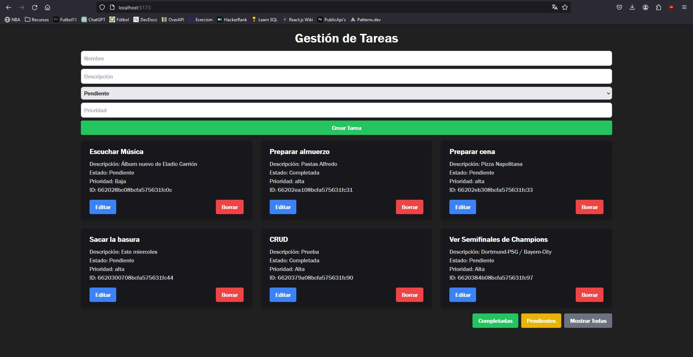

# CRUD Frontend
Aquí está como se ve el frontend después de su ejecución:

## Descripción

Abrir una terminal dentro de la carpeta frontend para descargar las dependencias:

    npm install

y luego, para ejecutar el proyecto:

    npm run dev

Se debe tener en cuenta que el backend debería estar en ejecución para que la aplicación funcione correctamente.